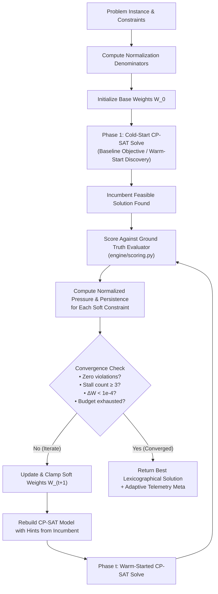

# Adaptive CP-SAT Multi-Objective Optimization Architecture

An in-depth technical specification and algorithmic guide to the **Adaptive CP-SAT Engine** implemented in the Multiobjective Timetable Scheduler.

---

## 1. Executive Summary & Problem Motivation

University course timetabling is inherently a **multi-objective combinatorial optimization problem** with conflicting priorities:
1. **Student Comfort**: Minimizing unallotted idle gaps, avoiding excessive day span, and preventing multi-hour consecutive voids.
2. **Pedagogical Balance**: Distributing practical lab sessions across the week, ensuring mid-day recess bands, and breaking long runs of heavy/difficult subjects.
3. **Faculty Welfare**: Evenly spreading weekly teaching hours across days to avoid burnout.
4. **Institutional Efficiency**: Maximizing room and specialized laboratory capacity utilization.

### Why Static Weights Fail
In traditional single-pass constraint programming (e.g., standard CP-SAT with a scalarized objective $\min \sum_k w_k C_k$), fixed penalty weights suffer from fundamental shortcomings:
* **Scale Disparity**: Different constraints have wildly different baseline scales (e.g., room capacity waste can span hundreds of seat-hours, whereas student idle gaps span 0–10 hours). A static weight profile calibrated for one division often causes another division's constraints to be starved.
* **Pareto Blindness**: Static weights lock the solver into a single search trajectory. If the solver finds an integer feasible solution where one objective is heavily compromised, branch-and-bound pruning can prevent it from exploring trade-offs in other objective dimensions.
* **Hard/Soft Boundary Rigidity**: As problem complexity grows (e.g., cross-year room sharing between SY, TY, and Final Year), static penalty vectors frequently stall on local Pareto plateaus.

### The Adaptive Solution
The **Adaptive CP-SAT Controller** ([`engine/adaptive.py`](file:///v:/Projects/IPD/mutliobjective-timetable-scheduler-/engine/adaptive.py)) replaces static scalarization with an **iterative feedback loop**. It runs successive solving phases, evaluates incumbent solutions against ground-truth multi-objective metrics, computes normalized violation pressure and persistence, and dynamically reweights the objective function for subsequent warm-started CP-SAT iterations.

---

## 2. Architectural Overview & Execution Loop



---

## 3. Mathematical Formulation

### 3.1. CP-SAT Objective Scalarization
In each iteration $t$, the CP-SAT model minimizes the dynamic weighted sum of soft constraint decision variables:

$$\min \mathcal{Z}^{(t)} = \sum_{k \in \mathcal{K}} W_k^{(t)} \sum_{i \in \mathcal{T}_k} X_{k, i}$$

Where:
* $\mathcal{K}$ is the set of active soft constraint categories (e.g., `idle_gaps`, `day_span`, `room_capacity_waste`).
* $W_k^{(t)}$ is the dynamic penalty weight for constraint $k$ at iteration $t$.
* $X_{k, i}$ are the auxiliary integer/boolean penalty variables instantiated inside the CP-SAT model.

---

### 3.2. Normalization Denominators
To eliminate scale disparity across disparate constraint types, raw violation counts $v_{k, \text{raw}}$ are normalized by their theoretical maximum scale for the given problem instance ([`compute_normalization_denominators`](file:///v:/Projects/IPD/mutliobjective-timetable-scheduler-/engine/adaptive.py#L56-L92)):

$$v_k^{(t)} = \frac{v_{k, \text{raw}}^{(t)}}{\mathcal{D}_k}$$

The normalization denominators $\mathcal{D}_k$ are computed statically from the problem instance dimensions ($N_{\text{div}}$ divisions, $N_{\text{fac}}$ faculty, $D$ teaching days):

| Constraint Key ($k$) | Denominator Formula ($\mathcal{D}_k$) | Physical Meaning |
| :--- | :--- | :--- |
| **`room_capacity_waste`** | $\max(1.0, \text{MaxCapacity} \times \sum \text{SessionHours})$ | Maximum conceivable unutilized seat-hours |
| **`lab_not_before_final_slots`** | $\max(1.0, \text{Count}(\text{Practicals}))$ | Total practical lab requirements |
| **`break_not_midmorning`** | $\max(1.0, N_{\text{div}} \times D \times \lfloor \text{SlotsPerDay} / 2 \rfloor)$ | Maximum potential period distance from ideal recess |
| **`day_span`** | $\max(1.0, N_{\text{div}} \times D \times 2.0)$ | Bounded excess span beyond compact 7-hour target |
| **`idle_gaps`** | $\max(1.0, N_{\text{div}} \times D \times 2.0)$ | Maximum expected idle hours between lectures |
| **`consecutive_gaps`** | $\max(1.0, N_{\text{div}} \times D \times 1.0)$ | Severe multi-hour void opportunities |
| **`teacher_workload_spread`** | $\max(1.0, N_{\text{fac}} \times 6.0)$ | Workload variance bound across weekly teaching load |

---

### 3.3. Violation Pressure & Persistence
To avoid reactive oscillation ("chattering") when adjusting weights, the controller tracks **historical momentum** and **consecutive persistence**:

$$\text{Pressure}_k^{(t)} = a \cdot v_k^{(t)} + b \cdot v_k^{(t-1)} + c \cdot \mathcal{P}_k^{(t)}$$

* **Current Normalized Violation** ($v_k^{(t)}$): Instantaneous penalty severity (coefficient $a = 1.0$).
* **Previous Normalized Violation** ($v_k^{(t-1)}$): Short-term memory (coefficient $b = 0.5$).
* **Consecutive Persistence Count** ($\mathcal{P}_k^{(t)}$): Integer tracking how many consecutive iterations constraint $k$ has remained stubbornly violated without improvement (coefficient $c = 0.25$).

#### Persistence Update Logic:
* If $v_{k, \text{raw}}^{(t)} > 0$ and $v_{k, \text{raw}}^{(t)} \ge v_{k, \text{raw}}^{(t-1)}$:  
  $$\mathcal{P}_k^{(t)} = \mathcal{P}_k^{(t-1)} + 1$$
* If $v_{k, \text{raw}}^{(t)} > 0$ and $v_{k, \text{raw}}^{(t)} < v_{k, \text{raw}}^{(t-1)}$ (improving):  
  $$\mathcal{P}_k^{(t)} = \max\left(1, \mathcal{P}_k^{(t-1)} - 1\right)$$
* If $v_{k, \text{raw}}^{(t)} = 0$ (satisfied):  
  $$\mathcal{P}_k^{(t)} = 0$$

---

### 3.4. Weight Adaptation & Decay

Depending on whether constraint $k$ was violated in the incumbent solution:

#### Case A: Constraint is Violated ($v_{k, \text{raw}}^{(t)} > 0$)
The weight increases proportionally to the learning rate $\eta$ and total pressure:

$$W_k^{(t+1)} = W_k^{(t)} \times \left(1.0 + \eta \cdot \text{Pressure}_k^{(t)}\right)$$

*(Default $\eta = 0.15$)*

#### Case B: Constraint is Satisfied ($v_{k, \text{raw}}^{(t)} = 0$)
If a constraint has been resolved, its weight gently decays towards its base weight $W_k^{(0)}$ using decay factor $\gamma$:

$$W_k^{(t+1)} = \max\left(W_k^{(0)}, W_k^{(t)} \times \gamma\right)$$

*(Default $\gamma = 0.95$)*

#### Clamping & Regularization
To prevent numerical instability or runaway weights from starving other rules, updated weights are strictly clamped:

$$W_k^{(t+1)} \leftarrow \text{clamp}\left(W_k^{(t+1)}, W_{\min}, W_{\max}\right)$$

*(Default bounds: $W_{\min} = 1.0$, $W_{\max} = 200.0$)*

---

## 4. Time Budget Allocation & Warm-Start Hints

Solving large integer linear programs repeatedly could easily exhaust wall-clock limits if time was partitioned naively. [`CPSATSolver._solve_adaptive`](file:///v:/Projects/IPD/mutliobjective-timetable-scheduler-/engine/solvers/cpsat.py#L673-L777) uses a **two-tier adaptive time budget**:

1. **Iteration 1 (Cold Start Incumbent Discovery)**:
   * Allocated $\max(30.0\text{s}, \frac{T_{\text{budget}}}{2})$ of the total time budget.
   * Runs the baseline objective to quickly discover an initial integer-feasible solution without getting stuck in non-convex multi-objective trade-offs.
2. **Subsequent Iterations ($t \ge 2$, Adaptive Refinement)**:
   * Time limit dynamically divided across remaining iterations:
     $$T_{\text{iter}} = \min\left(T_{\text{remaining}}, \max\left(25.0\text{s}, \frac{T_{\text{remaining}}}{N_{\text{max}} - t + 1}\right)\right)$$
   * **Warm-Start Injection**: The previous iteration's assignments are injected directly into CP-SAT via `model.AddHint(x[req_id, slot_id, room_id], 1)`. This provides a high-quality incumbent feasible point, allowing CP-SAT's LNS (Large Neighborhood Search) workers to focus exclusively on optimizing the updated soft objective without re-proving feasibility from scratch.

---

## 5. Convergence Criteria & Stopping Rules

The iteration loop terminates as soon as any of the following four conditions are met:

1. **Ideal Solution (Zero Violations)**:
   $$\forall k \in \mathcal{K}, \ v_{k, \text{raw}} = 0$$
   *Reason: "All soft constraints fully satisfied (zero violations)"*
2. **Search Stagnation (Stall Threshold)**:
   $$\text{stall\_count} \ge \text{stall\_iterations} \ (3)$$
   If no candidate solution produces a strictly better score (lexicographically: fewer hard violations or $\Delta\text{SoftCost} > \epsilon$), the stall counter increments.
   *Reason: "No meaningful improvement for 3 consecutive iterations"*
3. **Weight Equilibrium**:
   $$\max_{k} \left|W_k^{(t+1)} - W_k^{(t)}\right| < 10^{-4}$$
   *Reason: "Weight adjustments stabilized (delta < 1e-4)"*
4. **Time Budget Exhaustion**:
   $$T_{\text{remaining}} < 1.0\text{s}$$

---

## 6. Code Walkthrough & Implementation Map

| File | Primary Role | Key Components |
| :--- | :--- | :--- |
| [`engine/adaptive.py`](file:///v:/Projects/IPD/mutliobjective-timetable-scheduler-/engine/adaptive.py) | Controller & Math Engine | `AdaptiveConfig`<br/>`AdaptiveWeightController`<br/>`compute_normalization_denominators`<br/>`update()` |
| [`engine/solvers/cpsat.py`](file:///v:/Projects/IPD/mutliobjective-timetable-scheduler-/engine/solvers/cpsat.py) | CP-SAT Integration | `CPSATSolver._solve_adaptive`<br/>`_apply_weighted_objective`<br/>`_solve_and_decode` (warm-start hinting) |
| [`engine/scoring.py`](file:///v:/Projects/IPD/mutliobjective-timetable-scheduler-/engine/scoring.py) | Ground Truth Evaluator | `score()`<br/>`SOFT_WEIGHTS`<br/>`ScoreResult` |
| [`webapp/routers/runs.py`](file:///v:/Projects/IPD/mutliobjective-timetable-scheduler-/webapp/routers/runs.py) | Web Platform API | Dispatches `optimization_mode="adaptive"` to solver background task |
| [`webapp/static/platform.js`](file:///v:/Projects/IPD/mutliobjective-timetable-scheduler-/webapp/static/platform.js) | Frontend UI | Surfaces optimization modes (`Baseline`, `Priority`, `Adaptive CP-SAT`) and displays adaptive iteration telemetry |

---

## 7. Configuration Reference (`AdaptiveConfig`)

```python
@dataclass
class AdaptiveConfig:
    enabled: bool = True
    max_iterations: int = 10                  # Maximum reweighting iterations
    learning_rate: float = 0.15               # η: scaling factor for violation pressure
    decay_factor: float = 0.95                # γ: decay factor for satisfied constraints
    min_weight: float = 1.0                   # Lower clamp bound
    max_weight: float = 200.0                 # Upper clamp bound
    stall_iterations: int = 3                 # Terminate if stalled for 3 iterations
    current_weight_factor: float = 1.0        # Factor 'a' in pressure formula
    previous_weight_factor: float = 0.5       # Factor 'b' in pressure formula
    persistence_factor: float = 0.25          # Factor 'c' in pressure formula
    improvement_epsilon: float = 0.01         # Minimum soft cost delta to count as progress
    time_limit_per_iteration_s: float = None  # None = dynamic budget allocation
    base_weights: dict[str, float] = None     # Optional overrides for initial weights
```

---

## 8. Summary of Benefits

1. **Eliminates Manual Weight Tuning**: Automatically discovers the optimal objective trade-offs for varied curriculum loads.
2. **Guarantees Feasibility First**: By employing lexicographical incumbents and warm-start hints, hard feasibility is never degraded while hunting for soft improvements.
3. **Escapes Local Minima**: Dynamic persistence and pressure force the solver's LNS workers to explore alternative schedule topographies when stubborn idle gaps or excessive spans resist standard minimization.
4. **High Predictability**: Entirely deterministic given the random seed and solver parameter configuration.
